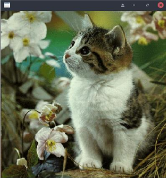
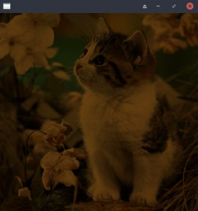
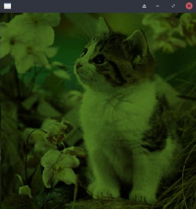

# DIR-Sistema-Distribuido-de-Renderizado-de-Gráficos

Práctica de Infraestructura de Red basado en un Sistema Distribuido de Renderizado de Gráfico con MPI. 

Para la compilación del programa:

    make

Para la ejecución del programa:

    make run

En este programa se aplica una serie de filtros:

-   Filtro normal 

-   Filtro sepia

-   Filtro escala de grises

-   Filtro bajo contraste

